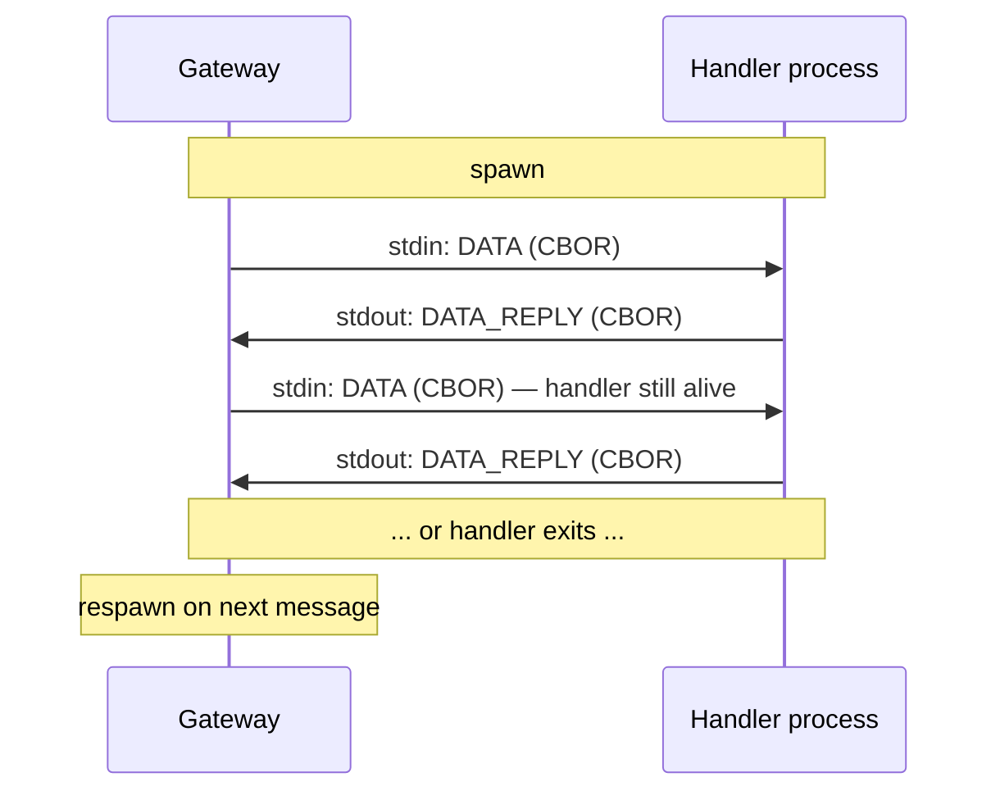

<!-- SPDX-License-Identifier: MIT
  Copyright (c) 2026 sonde contributors -->
# Application API

> **Document status:** Draft  
> **Scope:** The data-plane API between a Sonde gateway and developer applications.  
> **Audience:** Developers building applications on the Sonde platform.  
> **Related:** [gateway-requirements.md](gateway-requirements.md), [protocol.md](protocol.md)

---

## 1  Overview

A Sonde application consists of two parts:

1. **A BPF program** — runs on the node, reads sensors, and calls `send()` or `send_recv()` to communicate with the handler.
2. **An application handler** — runs alongside the gateway, receives that data, and replies.

The gateway handles everything in between: protocol, authentication, program distribution, scheduling, node management. The developer never interacts with nodes, keys, or the radio protocol.

```
┌─────────────────────────────────────────────────────────────────┐
│                      Developer writes                           │
│                                                                 │
│  ┌──────────────────┐              ┌──────────────────────┐     │
│  │  BPF program     │              │  Application handler │     │
│  │  (sensors, logic)│              │  (data processing)   │     │
│  └────────┬─────────┘              └──────────┬───────────┘     │
│           │                                   │                 │
└───────────┼───────────────────────────────────┼─────────────────┘
            │                                   │
    ┌───────▼───────┐   radio   ┌───────────────▼───────────┐
    │  Sonde Node   │◄─────────►│  Sonde Gateway            │
    │  (firmware)   │           │  (protocol, auth, admin)  │
    └───────────────┘           └───────────────────────────┘
```

### What the developer sees

The developer thinks in terms of **programs and data**, not nodes and protocols:

- *"My soil moisture program sent me a reading — process it and reply with updated thresholds."*
- *"My temperature alert program fired — log it and notify me."*

### What the developer does NOT deal with

- Node provisioning, keys, authentication
- Program distribution, chunked transfer
- Scheduling, retries, timeouts
- Protocol framing, CBOR encoding
- Battery monitoring, firmware versions

These are the gateway's responsibility, managed by operations staff (see [gateway-requirements.md](gateway-requirements.md)).

---

## 2  Transport

The gateway communicates with the handler via **stdin/stdout** using length-prefixed CBOR messages. One unified model handles both one-shot and long-running handlers:

1. Gateway spawns the configured handler command.
2. Gateway writes `DATA` and `EVENT` messages to the handler's stdin.
3. Handler writes `DATA_REPLY` and `LOG` messages to stdout.
4. If the handler **stays running** → gateway keeps streaming messages to it.
5. If the handler **exits** → gateway respawns it when the next message arrives.

The developer doesn't choose a model — the gateway adapts. A simple script that processes one message and exits just works. A long-running service that loops on stdin also just works.

### 2.1  Framing

Each message (both directions) is length-prefixed:

```
┌──────────────────────────────────┐
│  Length (4 bytes, big-endian)    │
│  CBOR payload (Length bytes)     │
└──────────────────────────────────┘
```

Maximum message size: **1 MB** (1,048,576 bytes). Messages with a length field exceeding this value must be rejected and the connection closed. All CBOR payloads use **integer keys** as defined in the field tables below.

### 2.2  Lifecycle



**Exit handling:** If the handler exits with code 0 between messages, the gateway respawns it on the next message. If it exits with non-zero (or crashes mid-message), the gateway logs the error and does not send an `APP_DATA_REPLY` to the node (the node's `send_recv()` will timeout if it was waiting).

---

## 3  Message types

The application API has only **4 message types** — two in each direction.

> **Note:** These `msg_type` values are specific to the gateway↔handler API and are unrelated to the node↔gateway radio protocol's `msg_type` values defined in [protocol.md](protocol.md). The two protocols operate on separate transports and never share a channel.

### 3.1  Gateway → Handler

| msg_type | Name | Description |
|---|---|---|
| `0x01` | `DATA` | A BPF program sent data. Handler must reply. |
| `0x02` | `EVENT` | Informational lifecycle event. No reply needed. |

### 3.2  Handler → Gateway

| msg_type | Name | Description |
|---|---|---|
| `0x81` | `DATA_REPLY` | Response to a `DATA` message. |
| `0x82` | `LOG` | Optional: handler wants to log a message through the gateway. |

---

## 4  Message definitions

### 4.1  DATA (Gateway → Handler)

Sent when a node's BPF program calls `send()` or `send_recv()`. The handler processes the data and replies with a `DATA_REPLY`.

| Field | CBOR key | Type | Description |
|---|---|---|---|
| `msg_type` | 1 | uint | `0x01` |
| `request_id` | 2 | uint | Correlation ID. Echo this in the reply. |
| `node_id` | 3 | tstr | Stable, opaque identifier for the node (assigned by gateway admin). |
| `program_hash` | 4 | bstr | Hash of the BPF program that sent this data. |
| `data` | 5 | bstr | The opaque blob from the BPF program's `send()` or `send_recv()` call. |
| `timestamp` | 6 | uint | Unix timestamp of reception (seconds). |

**Key design decisions:**

- `node_id` is an **opaque string** assigned by the gateway admin (e.g., `"greenhouse-sensor-3"`). The developer never sees HMAC keys or key_hints.
- `program_hash` tells the handler which BPF program produced this data, so it knows how to decode the blob.
- `data` is opaque to the gateway — the BPF program and handler define their own schema.

---

### 4.2  DATA_REPLY (Handler → Gateway)

Response to a `DATA` message. The handler **always** replies:

- **Non-zero-length `data`**: The gateway sends an `APP_DATA_REPLY` to the node (the node's BPF program receives it via `send_recv()`).
- **Zero-length `data`**: The gateway does not send anything to the node (used when the BPF program called `send()` fire-and-forget).

The handler and BPF program are written by the same developer — they agree a priori on which messages expect data back.

| Field | CBOR key | Type | Description |
|---|---|---|---|
| `msg_type` | 1 | uint | `0x81` |
| `request_id` | 2 | uint | Must match the `DATA` message's `request_id`. |
| `data` | 3 | bstr | Reply blob for the BPF program. Zero-length = no reply to node. |

---

### 4.3  EVENT (Gateway → Handler)

Informational notification about node lifecycle. No reply required.

| Field | CBOR key | Type | Description |
|---|---|---|---|
| `msg_type` | 1 | uint | `0x02` |
| `node_id` | 3 | tstr | Opaque node identifier. |
| `event_type` | 4 | tstr | Event name (see below). |
| `details` | 5 | map | Event-specific key-value data. |
| `timestamp` | 6 | uint | Unix timestamp. |

#### Event types

| Event | Description | Details |
|---|---|---|
| `"node_online"` | Node completed a wake cycle. | `battery_mv`, `firmware_abi_version` |
| `"program_updated"` | Node installed a new program. | `program_hash` |
| `"node_timeout"` | Node has not woken within expected interval. | `last_seen`, `expected_interval_s` |

---

### 4.4  LOG (Handler → Gateway)

Optional: the handler can emit log messages through the gateway's logging system.

| Field | CBOR key | Type | Description |
|---|---|---|---|
| `msg_type` | 1 | uint | `0x82` |
| `level` | 2 | tstr | `"debug"`, `"info"`, `"warn"`, `"error"` |
| `message` | 3 | tstr | Log message text. |

---

## 5  Examples

### One-shot handler (Python)

Processes one message and exits. The gateway respawns it for the next message.

```python
import sys, cbor2

def read_exact(stream, n):
    """Read exactly n bytes from stream, or raise EOFError."""
    data = b''
    while len(data) < n:
        chunk = stream.read(n - len(data))
        if not chunk:
            raise EOFError()
        data += chunk
    return data

# Read one message from stdin
length = int.from_bytes(read_exact(sys.stdin.buffer, 4), 'big')
request = cbor2.loads(read_exact(sys.stdin.buffer, length))

# Ignore EVENT messages (msg_type 0x02)
if request[1] == 0x02:
    sys.exit(0)

# Process the sensor data
sensor_data = request[5]  # data field
# ... application logic ...

# Write DATA_REPLY to stdout
reply = cbor2.dumps({1: 0x81, 2: request[2], 3: reply_blob})
sys.stdout.buffer.write(len(reply).to_bytes(4, 'big'))
sys.stdout.buffer.write(reply)
```

### Long-running handler (Python)

Loops on stdin. Stays alive across messages — no respawn overhead.

```python
import sys, cbor2

def read_exact(stream, n):
    """Read exactly n bytes from stream, or raise EOFError."""
    data = b''
    while len(data) < n:
        chunk = stream.read(n - len(data))
        if not chunk:
            raise EOFError()
        data += chunk
    return data

try:
    while True:
        # Read length-prefixed message
        length = int.from_bytes(read_exact(sys.stdin.buffer, 4), 'big')
        request = cbor2.loads(read_exact(sys.stdin.buffer, length))

        if request[1] == 0x02:  # EVENT — no reply needed
            continue

        # Process DATA and reply
        sensor_data = request[5]
        # ... application logic ...

        reply = cbor2.dumps({1: 0x81, 2: request[2], 3: reply_blob})
        sys.stdout.buffer.write(len(reply).to_bytes(4, 'big'))
        sys.stdout.buffer.write(reply)
        sys.stdout.buffer.flush()
except EOFError:
    pass  # stdin closed, gateway shutting down
```

Both examples use the same framing and message format. The only difference is whether the process loops or exits.

---

## 6  Configuration

The gateway administrator configures handler routing. This is an ops/admin concern, not a developer concern.

Handlers are mapped by **program_hash**. When a node's BPF program sends `APP_DATA`, the gateway routes it to the handler configured for that program's hash. At deployment time, the administrator decides the granularity:

```yaml
# Example gateway configuration (format TBD)
handlers:
  # One handler per program
  - program_hash: "a1b2c3..."
    command: "/usr/local/bin/soil-moisture-app"

  - program_hash: "d4e5f6..."
    command: "/usr/local/bin/temperature-alert-app"

  # Or one handler for multiple programs
  - program_hash: ["7a8b9c...", "0d1e2f..."]
    command: "/usr/local/bin/multi-sensor-app"

  # Catch-all for unmatched programs (optional)
  - program_hash: "*"
    command: "/usr/local/bin/default-handler"
```

If no handler matches a `program_hash` and no catch-all is configured, the gateway does not send an `APP_DATA_REPLY` to the node. The BPF program's `send_recv()` will timeout if it was waiting for a reply; `send()` calls are unaffected.

---

## 7  Open questions

All open questions have been resolved.
